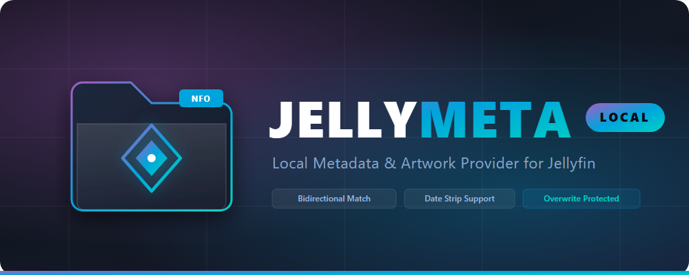

<p align="center">
  
</p>

<p align="center">
  <strong>A high-performance local metadata and artwork provider plugin for Jellyfin 10.11.11.</strong>
</p>

<p align="center">
  <a href="https://github.com/pradumnk-mahanta/jellymeta-local/releases"></a>
  <a href="https://jellyfin.org/"></a>
  <a href="LICENSE"></a>
</p>

---

## 🌟 Overview

**JellyMeta Local** (`Jellyfin.Plugin.JellyMetaLocal`) allows you to keep your metadata and artwork in a centralized or dedicated local directory and link it automatically with your media files. 

It matches media directory paths with metadata folders **bidirectionally**, strips leading or trailing dates (e.g., `2009-11-30 - FOLDER-1` &harr; `FOLDER-1`), imports NFO metadata and local artwork, and **locks the imported fields** so other online scrapers (e.g., TMDB, TVDB, OMDB) will not overwrite your local data. If no match is found, it cleanly passes control to the next provider in the chain.

---

## ✨ Features

- 🔄 **Bidirectional Folder Matching**: Matches folder names both ways, whether the media folder contains/ends with the metadata folder or vice versa.
- 📅 **Date Prefix & Suffix Stripping**: Automatically removes dates such as `YYYY-MM-DD - ` or `[YYYY-MM-DD]` (e.g., `2009-11-30 - FOLDER-1` &rarr; `FOLDER-1`).
- 📁 **Multi-Level Directory Support**: Handles nested media hierarchies (e.g. `/media/Type/Site/2009-11-30 - FOLDER-1/FILE.mp4`), targeting the last directory containing the file and checking parent directories.
- 🛡️ **Overwrite Protection**: Once local metadata is matched, the item is marked locked (`IsLocked = true`) with locked fields (`Name`, `Overview`, `Genres`, `Studios`, `Tags`, `OfficialRating`, `Runtime`, `ProductionLocations`, `Cast`) to prevent other plugins from overwriting it.
- ⏩ **Graceful Fall-through**: If no matching local metadata folder is found, returns `HasMetadata = false` so other enabled metadata providers can scrape normally.
- 🖼️ **Complete Artwork Support**: Automatically imports:
  - **Poster**: `poster.png`, `poster.jpg`, `cover.*`, `folder.*`
  - **Banner**: `banner.png`, `banner.jpg`, `banner.webp`
  - **Backdrop / Fanart**: `backdrop.*`, `fanart.*`, `background.*`
  - **Thumb / Landscape**: `thumb.*`, `landscape.*`
  - **Logo / ClearArt**: `logo.png`, `clearart.*`
- 📑 **Comprehensive NFO Parsing**: Reads titles, original titles, sort titles, plot/overviews, taglines, release dates, MPAA ratings, community ratings, genres, studios, production countries, and cast/crew with roles and images.

---

## 📂 Directory Structure Examples

### Metadata Directory (`/metadata`)
```text
/metadata/
├── FOLDER-1/
│   ├── FOLDER-1.nfo        # Or movie.nfo / tvshow.nfo / *.nfo
│   ├── poster.png
│   └── banner.png
├── FOLDER-2/
│   ├── FOLDER-2.nfo
│   ├── poster.png
│   └── banner.png
└── FOLDER-3/
    ├── FOLDER-3.nfo
    ├── poster.png
    ├── banner.png
    └── backdrop.jpg
```

### Media Library Directory (`/media`)
```text
/media/
└── Type/
    └── Site/
        ├── 2009-11-30 - FOLDER-1/
        │   └── FILE.mp4             <-- Matches /metadata/FOLDER-1/
        ├── 2015-05-12 - FOLDER-2/
        │   └── FILE.mp4             <-- Matches /metadata/FOLDER-2/
        └── FOLDER-3/
            └── video.mkv            <-- Matches /metadata/FOLDER-3/
```

---

## 🚀 Installation & Setup

### 1. Add Plugin Repository
In Jellyfin Dashboard:
1. Navigate to **Admin** &rarr; **Dashboard** &rarr; **Plugins** &rarr; **Repositories**.
2. Click **+** to add a new repository:
   - **Repository Name**: `JellyMeta Local`
   - **Repository URL**: `https://raw.githubusercontent.com/pradumnk-mahanta/jellymeta-local/main/manifest.json`
3. Save, then open the **Catalog** tab.
4. Locate **JellyMeta Local** under the **Metadata** category and click **Install**.
5. Restart Jellyfin.

### 2. Configure Plugin
1. Navigate to **Dashboard** &rarr; **Plugins** &rarr; **JellyMeta Local**.
2. Set your **Metadata Root Directory** (e.g. `/metadata` or `D:\Metadata`).
3. Toggle options as desired:
   - **Strip Date Prefixes and Suffixes** *(Enabled by default)*
   - **Bidirectional Folder Matching** *(Enabled by default)*
   - **Normalize Separators** *(Enabled by default)*
   - **Scan Subdirectories in Metadata Root** *(Enabled by default)*
   - **Lock Metadata If Found** *(Enabled by default)*
4. Click **Save**.

### 3. Enable in Library Settings
1. Navigate to **Dashboard** &rarr; **Libraries**.
2. Click the three dots `...` on your target library and select **Manage Library**.
3. Under **Metadata downloaders** (or **Movie metadata downloaders** / **Series metadata downloaders**):
   - Check **JellyMeta Local** and drag it to the top of the list.
4. Under **Image fetchers**:
   - Check **JellyMeta Local** and position it at the top.
5. Save settings and trigger a library scan or item refresh.

---

## 🛠️ Building from Source

### Requirements
- [.NET 9.0 SDK](https://dotnet.microsoft.com/download/dotnet/9.0) (or .NET 10 SDK)

```bash
# Clone the repository
git clone https://github.com/pradumnk-mahanta/jellymeta-local.git
cd jellymeta-local

# Build in Release configuration
dotnet build -c Release
```

The compiled assembly will be placed in `bin/Release/net9.0/Jellyfin.Plugin.JellyMetaLocal.dll`.

---

## 📄 License

This project is licensed under the terms of the GNU General Public License v3.0 (GPLv3). See [LICENSE](LICENSE) for details.
